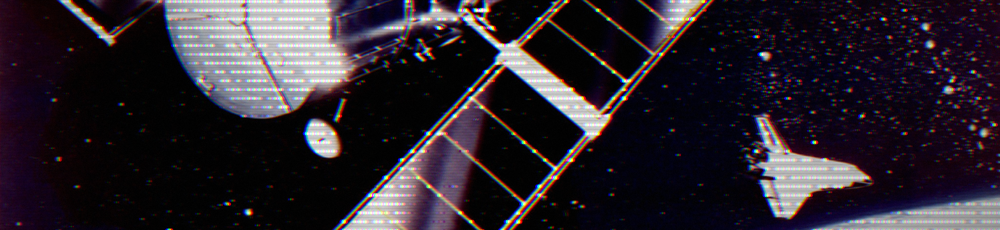

<!--# Hi there! 👋-->

## 🌌 About Me
* 🎓 **Education:** Pursuing CS & Economics at WashU (Expected May 2027).
* 🛠️ **Flight & Systems Engineering:** Focused on bare-metal flight software (Rust/STM32), real-time autonomous systems, and distributed telemetry infrastructure.
* 📡 **Current Work:** Comms & Ground Station Lead for WashU Satellite Club—building C++/Protobuf downlink layers and TCP/UDP architecture for upcoming CubeSat missions.
* ⚡ **Core Languages:** C++, Rust, Python, TypeScript.
* 🐾 When I'm not at my desk, I enjoy spending time with my cats, hanging around places with people who build shiny stuff, and playing pickleball with my girlfriend!

<!--
**JoshSmith247/JoshSmith247** is a ✨ _special_ ✨ repository because its `README.md` (this file) appears on your GitHub profile.

Here are some ideas to get you started:

- 🔭 I’m currently working on ...
- 🌱 I’m currently learning ...
- 👯 I’m looking to collaborate on ...
- 🤔 I’m looking for help with ...
- 💬 Ask me about ...
- 📫 How to reach me: ...
- 😄 Pronouns: ...
- ⚡ Fun fact: ...
-->
